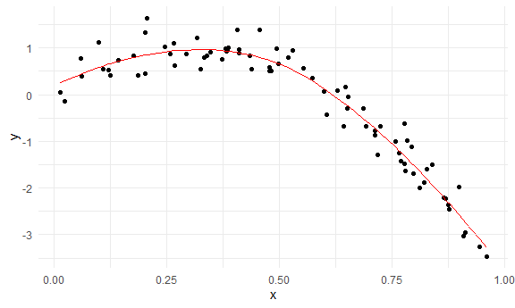

Cross Validation
================
Jessica Flynn
11/22/2020

``` r
library(tidyverse)
```

    ## -- Attaching packages --------------------------------------- tidyverse 1.3.0 --

    ## v ggplot2 3.3.2     v purrr   0.3.4
    ## v tibble  3.0.3     v dplyr   1.0.2
    ## v tidyr   1.1.2     v stringr 1.4.0
    ## v readr   1.3.1     v forcats 0.5.0

    ## -- Conflicts ------------------------------------------ tidyverse_conflicts() --
    ## x dplyr::filter() masks stats::filter()
    ## x dplyr::lag()    masks stats::lag()

``` r
library(p8105.datasets)
library(modelr)

set.seed(1)


theme_set(theme_minimal() + theme(legend.position = "bottom"))

options(
  ggplot2.continuous.colour = "viridis",
  ggplot2.continuous.fill = "viridis"
)

scale_colour_discrete = scale_colour_viridis_d
scale_fill_discrete = scale_fill_viridis_d

knitr::opts_chunk$set(
  fig.width = 6,
  fig.asp = .6,
  out.width = "90%"
)
```

## Simulate data

``` r
nonlin_df = 
  tibble(
    id = 1:100,
    x = runif(100, 0, 1),
    y = 1 - 10 * (x - .3) ^ 2 + rnorm(100, 0, .3)
  )

nonlin_df %>% 
  ggplot(aes(x = x, y = y)) + 
  geom_point()
```


## Cross validation – by hand

Get training and testing datasets

``` r
train_df = sample_n(nonlin_df, 80)
test_df = anti_join(nonlin_df, train_df, by = "id")

ggplot(train_df, aes(x = x, y = y)) + 
  geom_point() + 
  geom_point(data = test_df, color = "red")
```


Fit 3 models

``` r
linear_mod = lm(y ~ x, data = train_df)
smooth_mod = mgcv::gam(y ~ s(x), data = train_df)
wiggly_mod = mgcv::gam(y ~ s(x, k = 30), sp = 10e-6, data = train_df)
```

Can I see what I just did

``` r
train_df %>% 
  modelr::add_predictions(smooth_mod) %>% 
  ggplot(aes(x = x, y = y)) + geom_point() + 
  geom_line(aes(y = pred), color = "red")
```



``` r
train_df %>% 
  modelr::add_predictions(wiggly_mod) %>% 
  ggplot(aes(x = x, y = y)) + geom_point() + 
  geom_line(aes(y = pred), color = "red")
```


``` r
train_df %>% 
  modelr::add_predictions(linear_mod) %>% 
  ggplot(aes(x = x, y = y)) + geom_point() + 
  geom_line(aes(y = pred), color = "red")
```


``` r
train_df %>% 
  gather_predictions(linear_mod, smooth_mod, wiggly_mod) %>% 
  mutate(model = fct_inorder(model)) %>% 
  ggplot(aes(x = x, y = y)) + 
  geom_point() + 
  geom_line(aes(y = pred), color = "red") + 
  facet_wrap(~model)
```


Look at prediction accuracy

``` r
rmse(linear_mod, test_df)
```

    ## [1] 0.7052956

``` r
rmse(smooth_mod, test_df)
```

    ## [1] 0.2221774

``` r
rmse(wiggly_mod, test_df)
```

    ## [1] 0.289051
